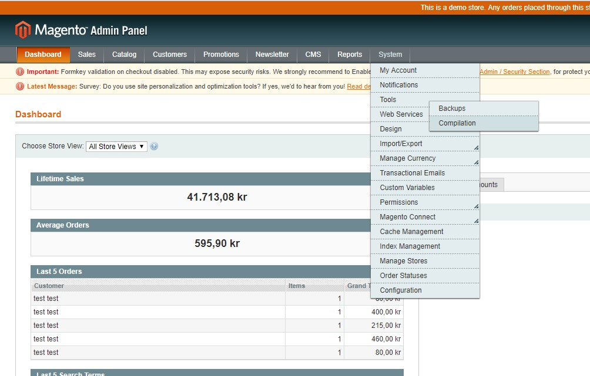
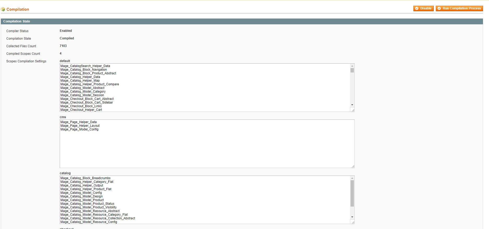
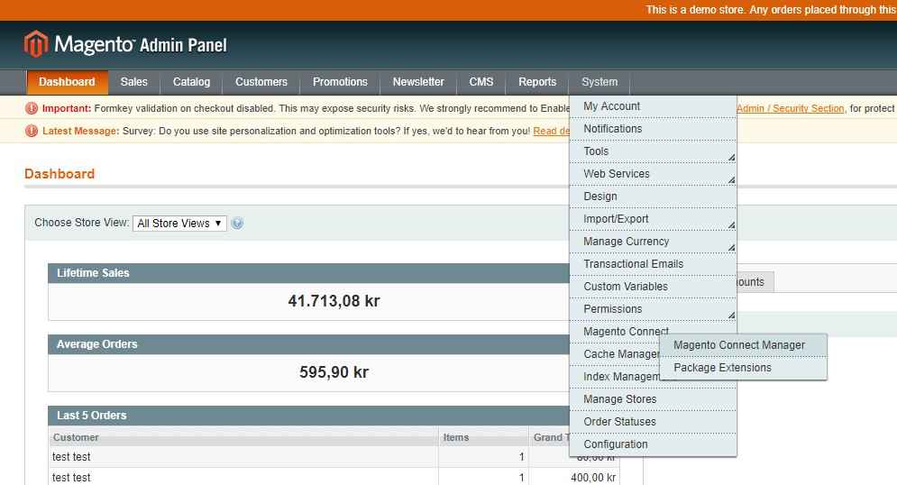
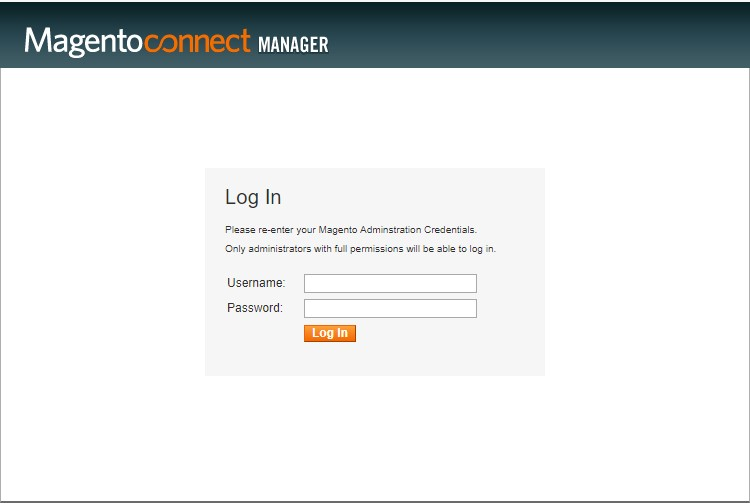
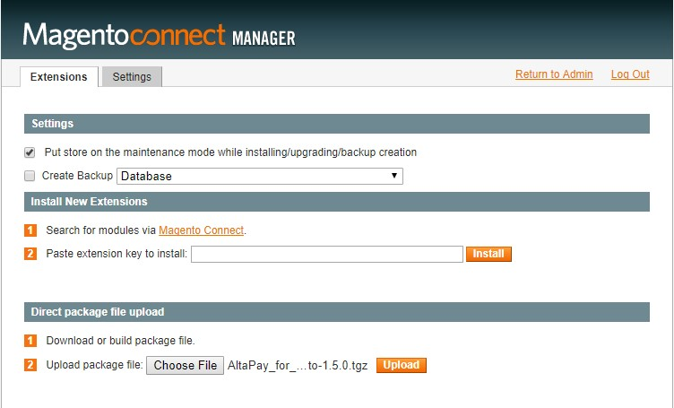
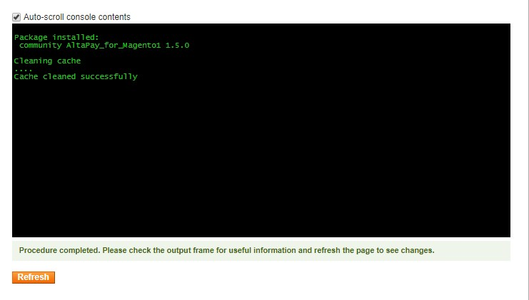
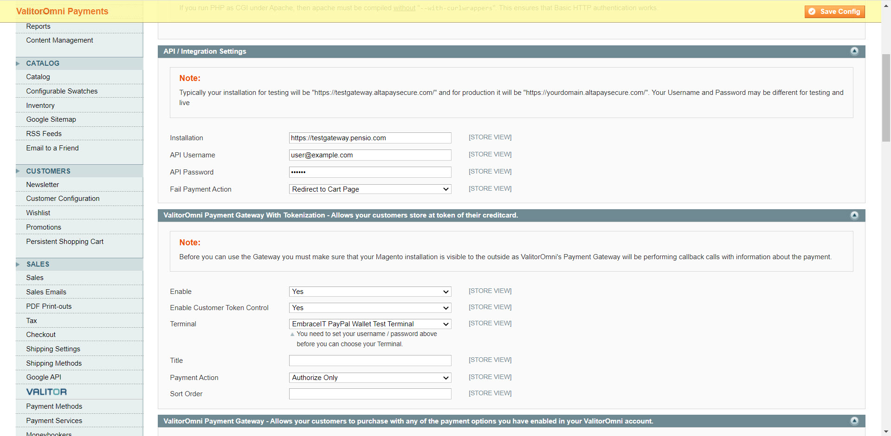
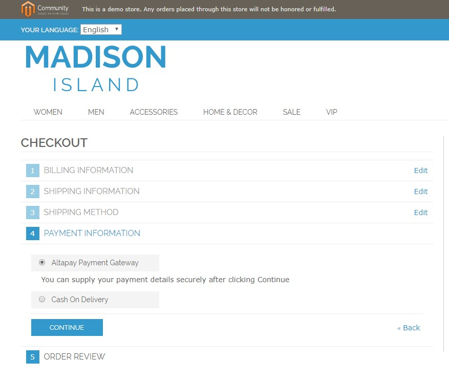
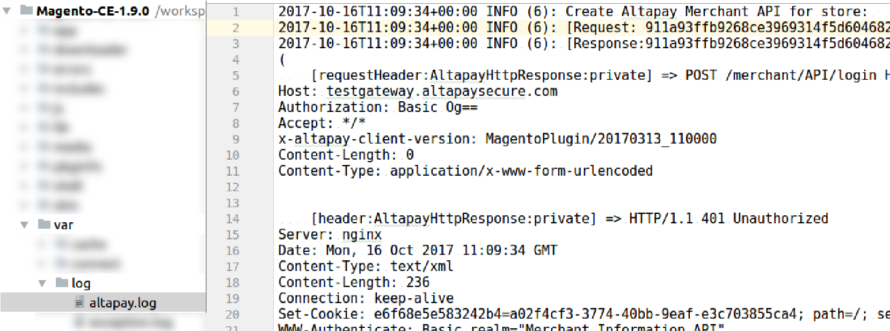

# AltaPay Magento 1 Plugin

AltaPay, headquartered in Denmark, is an internationally focused fintech company within payments with the mission to make payments less complicated. We help our merchants grow and expand their business across payment channels by offering a fully integrated seamless omni-channel experience for online, mobile and instore payments, creating transparency and reducing the need for manual tasks with one centralized payment platform.

AltaPay’s platform automizes, simplifies, and protects the transaction flow for shop owners and global retail and e-commerce companies, supporting and integrating smoothly into the major ERP systems. AltaPay performs as a Payment Service Provider operating under The Payment Card Industry Data Security Standard (PCI DSS).

# Magento1 Payment plugin installation guide

Installing this plugin will enable your website to handle card transactions through AltaPay's gateway.

We highly recommend gathering all the below information, before starting the installation.

**Table of Contents**

[Prerequisites](#prerequisites)

[Installation](#installation)

[Configuration](#configuration)

[Customization](#customization)

[Supported versions](#supported-versions)

[Troubleshooting](#troubleshooting)

[Misc](#misc)

# Prerequisites

Before configuring the plugin, you need the below information. These can
be provided by AltaPay.

1.  AltaPay credentials:

-   Username

-   Password

2.  AltaPay gateway information:

-   Terminal

-   Gateway

3. PHP bc-math library.

4. Prerequisites for fraud detection
  
- Agreement with external fraud partner such as ACI ReD or MaxMind. Be aware that only ‘Accept’ and ‘Decline’
    recommendations are accepted. AltaPay enables the fraud detection on the terminal.

> _Note: 
> PHP 7 is not compatible with Magento 1. See, for example: http://magento.stackexchange.com/questions/107583/grand-total-not-updated-when-discount-code-is-applied   
All customized files are subject to change when installing new version of the plugin. Keep in mind to backup and merge modified files during installation._ 

# Installation

## Via Magento Connect

- First step to take is to check if you have enabled compiler. If compiler is enabled, you need to disable it. To do so, log in to Magento
    Admin Panel. Go to **System >Tools > Compilation**

- And click on “Disable” button.

- After that go to **System > Magento Connect > Magento Connect Manager**.

- You’ll have to re-enter your administrator credentials.

- Navigate to the ”Direct package file upload” section and click on ”Choose File” button. In file browser window navigate to the
  plugin package provided by AltaPay and select it. After selecting plugin package, click on ”Upload” button. This will trigger plugin
  installation.

- Installation progress will be shown in the console screen on the same page where you can check if installation was successful.

- After successful installation make sure to enable compiler again if it was disabled in the first steps of installation.

# Configuration

You can configure the plugin to suit your needs, including adding
payment methods and configuring payments.

1. Go to: System > Configuration > AltaPay (If you get a 404 error, please flush your cache and logout and login again).
2. Define the gateway URL, username and password (URL for test environment is https://testgateway.altapaysecure.com).
3. Select option for "Fail Payment Action" dropdown. 
    -   <strong>Redirect to Cart Page</strong> - This will redirect user to cart page
    -   <strong>Redirect to Fail Page</strong> - This will redirect user to fail page 
4. Save the config to have the plug-in to pull a list of available terminals.
5. For each of the Gateway groups, you have the following options:

<table>
<tbody>
  <tr>
    <td><strong>Enable</strong></td>
    <td>Enable the payment method in the checkout.</td>
  </tr>
  <tr>
    <td><strong>Terminal</strong></td>
    <td>Here you select the appropriate terminal.</td>
  </tr>
  <tr>
    <td><strong>Title</strong></td>
    <td>Define the title shown in the checkout (this will not affect the name used other places, e.g. the e-mail send to customers).</td>
  </tr>
  <tr>
    <td><strong>Payment Action</strong></td>
    <td>Here you define if only an authorization should take place, or if the transaction should be captured immediately.</td>
  </tr>
  <tr>
    <td><strong>AVS</strong></td>
    <td>Enable Address Verification process.</td>
  </tr>
  <tr>
    <td><strong>Enforce AVS</strong></td>
    <td>If payment method does not provide AVS due to some reason, transaction will be rejected.</td>
  </tr>
  <tr>
    <td><strong>AVS accepted codes</strong></td>
    <td>Here you specify AVS Codes which you would like to accept. (comma separated)*</td>
  </tr>
  <tr>
    <td><strong>Sort Order</strong></td>
    <td>Defines the order in which the payment methods are listed in checkout.</td>
  </tr>
</tbody>
</table>

5. Save the file and make sure the Application-xxxx.js and current.js files have been regenerated.
6. When you have successfully set up environment you can start processing transactions through AltaPay.

## Customization

It is possible to customize various aspects of the plug-in. Below is a list with the most relevant files.

- Render the payment page.   `app/design/frontend/base/default/template/altapay/checkout/form.phtml`
- Style the payment form   `app/design/frontend/base/default/template/altapay/checkout/magento_styling.css`
- Display a failed page to the customer   `app/design/frontend/base/default/template/altapay/checkout/failed.phtml`
- Define what is stated as the payment method in the consumer’s e-mail   `app/design/frontend/base/default/template/altapay/payment/info/gateway.phtml`

> _Note: All customized files are subject of change when installing new version of the plug-in. Keep in mind to backup and merge modified
files during installation._

# Supported versions
- Magento 1 minimum supported version by the plugin is currently Magento CE 1.9.x 
- PHP supported versions: 5.4.x - 5.6.x

# Troubleshooting

**PHP Warning: Input variables exceeded 1000. To increase the limit change max_input_vars in php.ini.**

For orders that contain too many products, this PHP warning may be issued. You will need to:

- Open your php.ini file
- Edit the max_input_vars variable. This specifies the maximum number of variables that can be sent in a request. The default is 1000. Increase it to, say, 3000.
- Restart your server.

**Parameters: description/unitPrice/quantity are required for each orderline, but was not set for line: xxxx**
> The same problem as above. The request is being truncated because the number of variables are exceeding the max_input_vars limit.

## Providing error logs to support team

You can find the logs from the below path:

**CMS logs:**  
`<Magento directory>/var/logs/altapay{DATE}.log` where {DATE} represents the date when the log is created. For each date new log is created.

**Web server error logs:**

**For Apache server** You can find it on **/var/log/apache2/error.log**

**For Nginx** it would be **/var/log/nginx/error.log**

**_Note: Your path may vary from the mentioned above._**

# Misc

<table>
<tbody>
  <tr>
    <td><strong>A</strong></td>
    <td>Address matches, but zip code does not</td>
  </tr>
  <tr>
    <td><strong>B</strong></td>
    <td>Street address matches, post code not verified due to incompatible formats</td>
  </tr>
  <tr>
    <td><strong>C</strong></td>
    <td>Street address and postal code not verified for international transaction due to incompatible formats</td>
  </tr>
  <tr>
    <td><strong>D</strong></td>
    <td>Street address and postal codes match for international transaction</td>
  </tr>
  <tr>
    <td><strong>E</strong></td>
    <td>AVS not supported for this industry</td>
  </tr>
  <tr>
    <td><strong>F</strong></td>
    <td>Full Match - Address and Zip/Postal Code match (UK Only)</td>
  </tr>
  <tr>
    <td><strong>G</strong></td>
    <td>Address information is unavailable; international transaction; non-AVS participant</td>
  </tr>
  <tr>
    <td><strong>I</strong></td>
    <td>Address information not verified for international transaction</td>
  </tr>
  <tr>
    <td><strong>M</strong></td>
    <td>Street address and postal codes match for international transaction</td>
  </tr>
  <tr>
    <td><strong>N</strong></td>
    <td>No Match on Address (Street) or Zip</td>
  </tr>
  <tr>
    <td><strong>P</strong></td>
    <td>Postal codes match for international transaction. Street address not verified due to incompatible formats</td>
  </tr>
  <tr>
    <td><strong>Q</strong></td>
    <td>Unknown response from issuer/bank-net switch</td>
  </tr>
  <tr>
    <td><strong>R</strong></td>
    <td>Retry. System unable to process</td>
  </tr>
  <tr>
    <td><strong>S</strong></td>
    <td>AVS not supported for this industry</td>
  </tr>
  <tr>
    <td><strong>U</strong></td>
    <td>Address information is unavailable</td>
  </tr>
  <tr>
    <td><strong>W</strong></td>
    <td>Nine-digit zip code matches, but address does not</td>
  </tr>
  <tr>
    <td><strong>X</strong></td>
    <td>Exact. Nine-digit zip code and address match</td>
  </tr>
  <tr>
    <td><strong>Y</strong></td>
    <td>Yes. Five-digit zip code and address match</td>
  </tr>
  <tr>
    <td><strong>Z</strong></td>
    <td>Five-digit zip code matches, but address does not</td>
  </tr>
</tbody>
</table>
